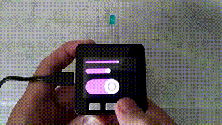

# m5_switch_panel

[](LICENSE)
[](https://platformio.org/)

M5Stack animated switch



youtube https://www.youtube.com/watch?v=hHPt8RRSGxY

## Usage

```cpp

#include <M5Stack.h>

/* Subject */
#include "SwitchPanel.h"
m5_mytool::SwitchPanel sp;

/* Listener(Observer) */
#include "ToggleSwitch.h"
m5_mytool::ToggleSwitch ts(10,20,200,10); // x, y, width, height

void setup()
{
  M5.begin();

  sp.Add(ts); // register ToggleSwitch in SwitchPanel
  sp.Init(); // start drawing
}

void loop()
{

    // e.g. bool is_high = digitalRead(PIN_NUM)

    // make the state transition by giving a signal
    bool ts_state = ts.Check(is_high);

    delay(10);
}
```


